# Stories do Instagram
Este projeto tem como objetivo desenvolver uma pequena aplicação que simule os efeitos e funcionalidades ao estilo Instagram.

A aplicação deve permitir ao usuário:
- Carregar uma imagem ou vídeo
- Aplicar diferentes filtros (você deve oferecer pelo menos 4 opções diferentes)
- Adicionar stickers (figurinhas predefinidas)
- Adicionar outro elemento a sua escolha (gif, texto, temperatura, local, selfie, etc...)
- Salvar a foto ou vídeo editado
- Interação por teclado e/ou mouse


## Sumário
1.  [Requisitos](#requisitos)
2.  [Funcionamento](#funcionamento-do-programa)
3.  [Funções utilizadas da biblioteca OpenCV](#Funções-utilizadas-da-biblioteca-OpenCV)
4.  [Técnicas e funções](#técnicas-e-funções)\
    4.1  [Brilho e contraste](#brilho-e-contraste)\
    4.2  [Blur](#blur)\
    4.3  [Gray](#gray-tons-de-cinza)\
    4.4  [Detector de bordas canny](#detector-de-bordas-canny)\
    4.5  [Negativo da imagem](#negativo-da-imagem)\
    4.6  [Pontilhismo](#pontilhismo)\
    4.7  [K-means](#k-means)\
    4.8  [Stickers](#stickers)\
    4.9  [Texto](#texto)
5.  [Exemplo de edição de vídeo](#Exemplo-de-edição-de-vídeo)
6.  [Funcionamento do código](#funcionamento-do-código)
7.  [Conclusão](#conclusão)
8.  [Código final completo em Python](#código-final-completo-em-python)

## Requisitos
- Python 3.8
- OpenCV 4.5.3
- Numpy
- Imutils
- PyQt5
- PyQt5 tools

## Funcionamento do programa
O programa carrega uma interface bem simples para o usuário, onde é possível carregar fotos ou vídeos para edição. Ao carregar uma foto ou um vídeo, o usuário tem a opção de utilizar diversos filtros, dentre eles o ajuste de contraste, brilho, blur, tons de cinza, detector de bordas canny, negativo, pontilhismo, k-means, adicionar stickers e também texto. O objetivo é proporcionar uma experiência agradável para o usuário editar imagens e vídeos, gerando um resultado satisfatório.

Para utilizar é necessário seguir estes passos:
- Criar o ambiente virtual para execução do código, instalando os pacotes conforme os requisitos acima.
- Realizar o comando git clone para clonar o repositório, ou copiar somente a pasta stories-instagram para a pasta do seu projeto.
- Executar o arquivo stories_instagram.py para iniciar a aplicação.

## Funções utilizadas da biblioteca OpenCV
- cvtColor()
- threshold()
- bitwise_not()
- bitwise_and()
- add()
- convertScaleAbs()
- GaussianBlur()
- Canny()
- circle()
- kmeans()
- imread()
- putText()
- imwrite()
- VideoCapture()
- VideoWriter_fourcc()
- VideoWriter()

## Tela inicial
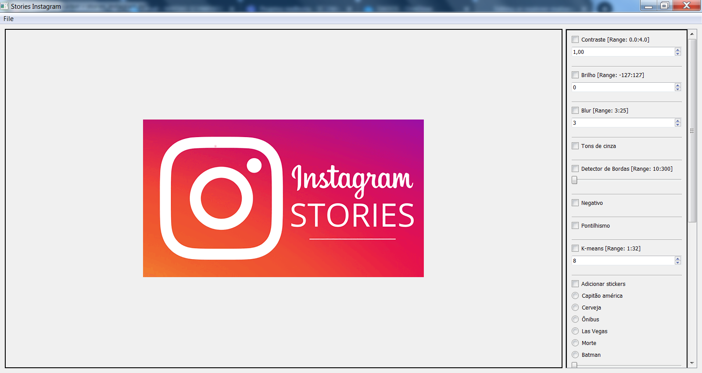

## Tela com uma imagem de exemplo carregada.
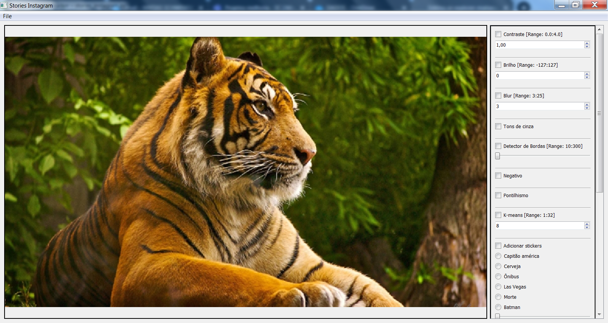

## Técnicas e funções

### Brilho e contraste
Para ajuste de brilho e contraste, foi utilizada a função convertScaleAbs() para ajustar a imagem conforme os parâmetros passados leo usuário.
```
        if self.contrast_adjusted == True or self.brightness_adjusted == True:
            contrast = self.contrast_spinbox.value()
            brightness = self.brightness_spinbox.value()
            self.cv_image = cv2.convertScaleAbs(self.cv_image, self.processed_cv_image, contrast, brightness)
```
#### Contraste
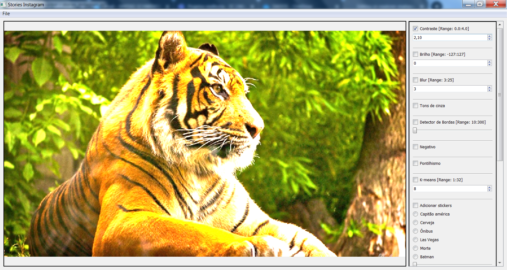
#### Brilho positivo
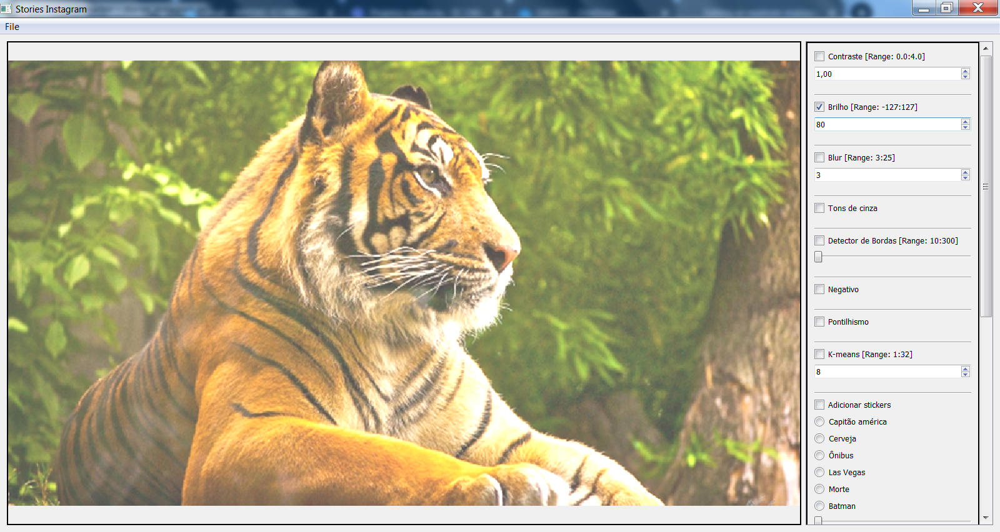
#### Brilho negativo
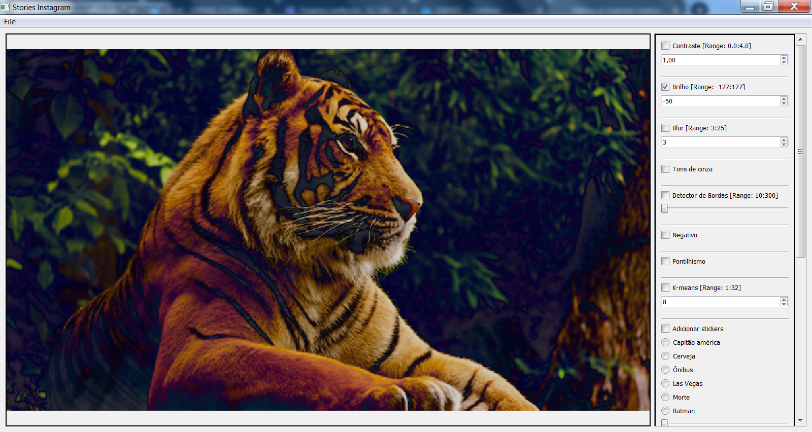


### Blur
Para causar o efeito de blur na imagem, foi utilizada a função GaussianBlur(), passando o tamanho do kernel como parâmetros da função, quanto maior, maior o efeito do blur na imagem.
```
        if self.image_smoothing_checked == True:
            blur = self.smoothing_spinbox.value()
            self.cv_image = cv2.GaussianBlur(self.cv_image, (blur, blur), 0)
```
#### Blur


### Gray Tons de cinza
Para transformar a imagem colorida em tons de cinza, foi utilizada a função cvtColor(), passando o parâmetro COLOR_BGR2GRAY.
```
        if self.gray_checked == True:
            if len(self.cv_image.shape) == 3:
                self.cv_image = cv2.cvtColor(self.cv_image, cv2.COLOR_BGR2GRAY)
            else:
                pass
```
#### Tons de cinza
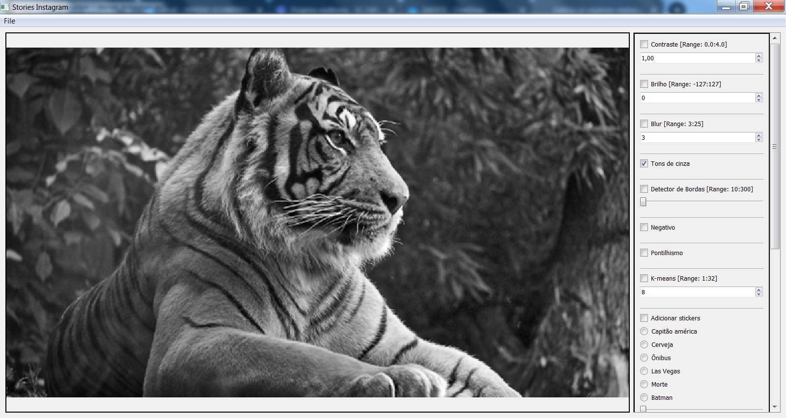


### Detector de bordas canny
Para detectar as bordas de uma imagem, foi utilizada a função Canny(), passando como parâmetro o valor do slider definido pelo usuário.
```
        if self.edge_detection_checked == True:
            slider = self.edges_slider.value()
            self.cv_image = cv2.Canny(self.cv_image, slider, 3 * slider)
```
#### Detecção de bordas com canny
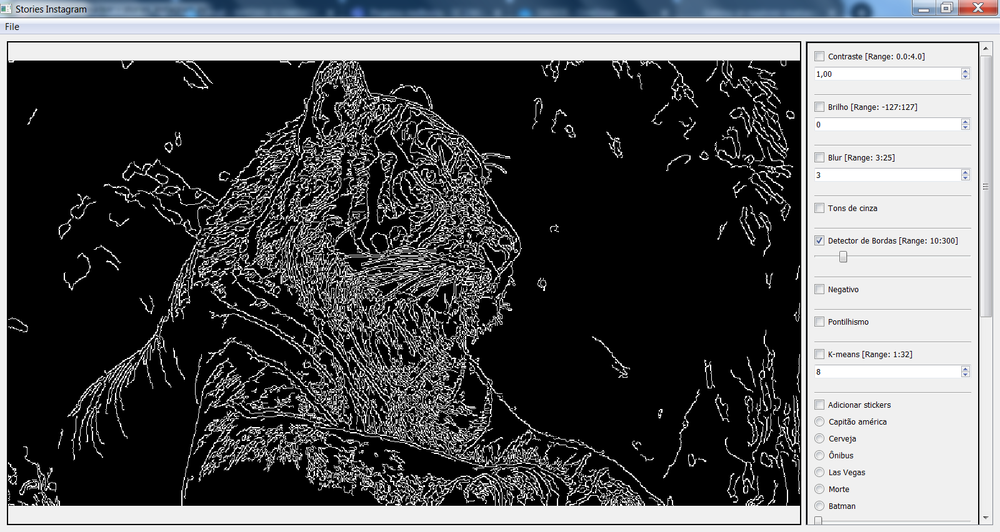


### Negativo da imagem
Para transformar a imagem em seu negativo, foi utilizado a função bitwise_not(), que inverte os bits de cada pixel da imagem.
```
        if self.negative_checked == True:
            self.cv_image = cv2.bitwise_not(self.cv_image)
```
#### Negativo da imagem
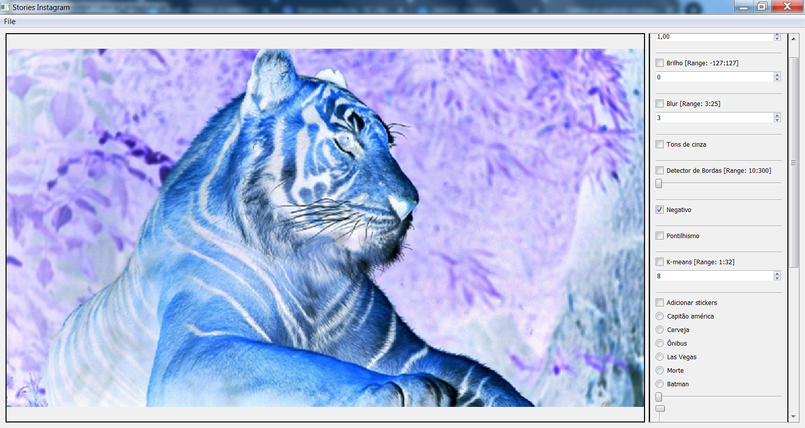


### Pontilhismo
Para criar o efeito de pontilhismo na imagem, foi utilizada a função circle(), que desenha círculos na nova imagem gerada com as cores da imagem original, antes de aplicar esta técnica, é utilizado funções para randomizar a distância dos centros de cada círculo com as bibliotecas do Numpy.
```
        if self.points_checked == True:
            STEP = 5
            JITTER = 3
            RAIO = 3
            xrange = np.arange(0, self.cv_image.shape[0] - STEP, STEP) + STEP // 2
            yrange = np.arange(0, self.cv_image.shape[1] - STEP, STEP) + STEP // 2
            points = np.zeros(self.cv_image.shape, dtype=np.uint8)
            np.random.shuffle(xrange)
            for i in xrange:
                np.random.shuffle(yrange)
                for j in yrange:
                    x = i + np.random.randint((2 * JITTER) - JITTER + 1)
                    y = j + np.random.randint((2 * JITTER) - JITTER + 1)
                    color = self.cv_image[x, y]
                    cv2.circle(points, (y, x), RAIO, (int(color[0]), int(color[1]), int(color[2])), -1, cv2.LINE_AA)
            self.cv_image = points.copy()
```
#### Pontilhismo
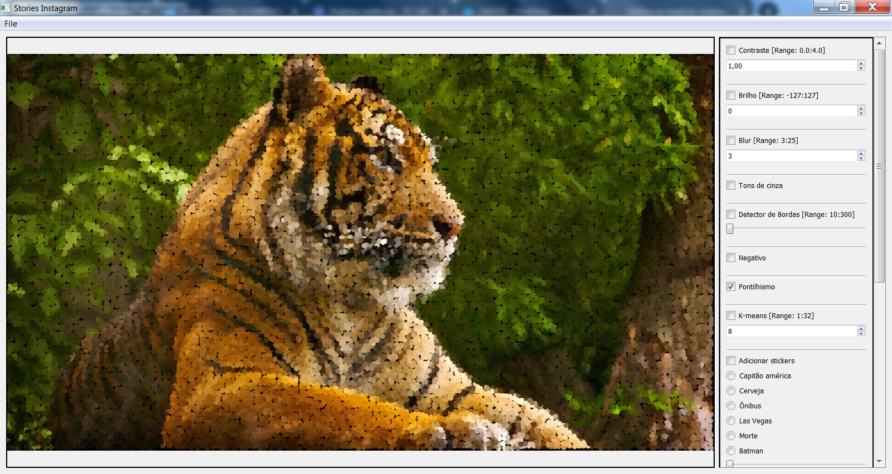


### K-means
Para clusterizar a imagem conforme o número de cores definido pelo usuário, foi utilizada a função kmeans(), passando como argumento o número de clusters de que se deseja.
```
        if self.kmeans_checked == True:
            NCLUSTERS = self.kmeans_spinbox.value()
            NROUNDS = 10
            samples = self.cv_image.reshape((-1, 3))
            samples = np.float32(samples)
            ret, labels, centers = cv2.kmeans(samples,
                                              NCLUSTERS,
                                              None,
                                              (cv2.TERM_CRITERIA_MAX_ITER | cv2.TERM_CRITERIA_EPS, 10, 1),
                                              NROUNDS,
                                              cv2.KMEANS_RANDOM_CENTERS)
            centers = np.uint8(centers)
            res = centers[labels.flatten()]
            self.cv_image = res.reshape((self.cv_image.shape))
```
#### K-means
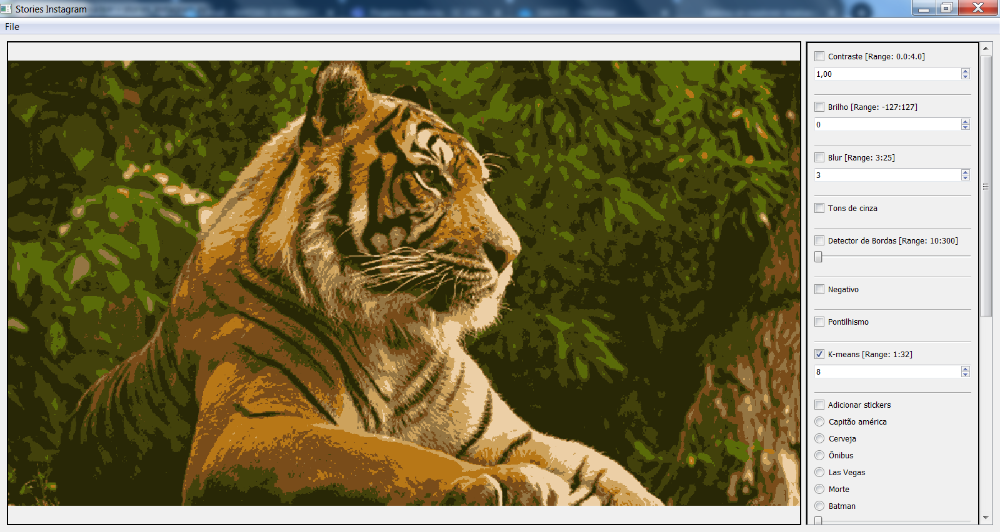


### Stickers
Para adicionar stickers, foi utilizada as funções threshold(), bitwise_not(), bitwise_and() e add() para criação da máscara e adição do sticker à imagem. Os sliders funcionam, facilitando o posicionamento do sticker em qualquer lugar na imagem, assim como também a função para modificar o tamanho do sticker.
```
    def overlaySticker(self):
        self.stickers_horizontal_slider.setRange(0, self.cv_image.shape[1])
        self.stickers_vertical_slider.setRange(0, self.cv_image.shape[0])

        self.size = self.stickers_spinbox.value()
        self.axis_x = self.stickers_horizontal_slider.value()
        self.axis_y = self.stickers_vertical_slider.value()

        self.sticker = imutils.resize(self.sticker, width=(self.cv_image.shape[0] // self.size))
        while True:
            if self.sticker.shape[1] <= self.cv_image.shape[1]:
                if self.sticker.shape[0] <= self.cv_image.shape[0]:
                    break
                else:
                    self.sticker = imutils.resize(self.sticker, height=(self.cv_image.shape[0] // 2))
            else:
                self.sticker = imutils.resize(self.sticker, width=(self.cv_image.shape[1] // 2))

        (rows, cols) = self.sticker.shape[:2]
        if (self.axis_y + rows) > self.cv_image.shape[0]:
            self.axis_y = self.cv_image.shape[0] - rows

        if (self.axis_x + cols) > self.cv_image.shape[1]:
            self.axis_x = self.cv_image.shape[1] - cols

        roi = self.cv_image[self.axis_y:(self.axis_y + rows), self.axis_x:(self.axis_x + cols)]
        self.sticker_gray = cv2.cvtColor(self.sticker, cv2.COLOR_BGR2GRAY)
        ret, mask = cv2.threshold(self.sticker_gray, 10, 255, cv2.THRESH_BINARY)
        mask_inv = cv2.bitwise_not(mask)
        self.cv_image_bg = cv2.bitwise_and(roi, roi, mask=mask_inv)
        self.sticker_fg = cv2.bitwise_and(self.sticker, self.sticker, mask=mask)
        dst = cv2.add(self.cv_image_bg, self.sticker_fg)
        self.cv_image[self.axis_y:(self.axis_y + rows), self.axis_x:(self.axis_x + cols)] = dst
```
\
#### Elementos stickers
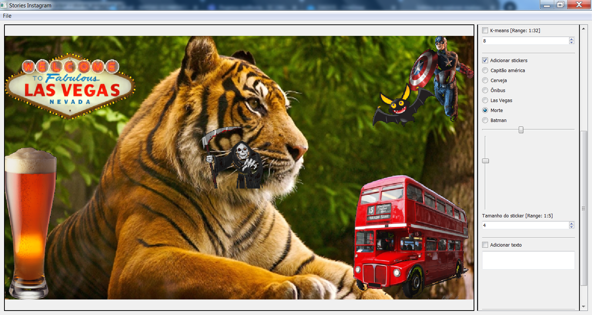

### Texto
Para adicionar texto, foi utilizada a função putText(), onde o usuário poderá inserir o texto, e este texto é adicionado an imagem.
```
        if self.text_checked == True:
            text = self.textQLine.text()
            font = cv2.FONT_HERSHEY_SIMPLEX
            org = (400, 400)
            fontScale = 1
            color = (0, 0, 255)
            thickness = 2
            self.cv_image = cv2.putText(self.cv_image, text, org, font, fontScale, color, thickness, cv2.LINE_AA, False)
```
#### Adição de texto
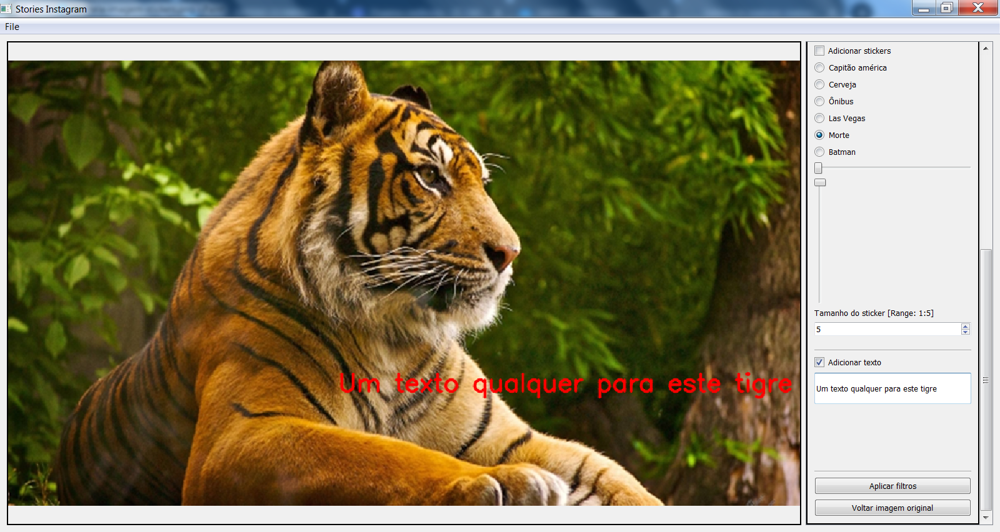

### Resultado da imagem processada

#### Imagem processada com vários elementos
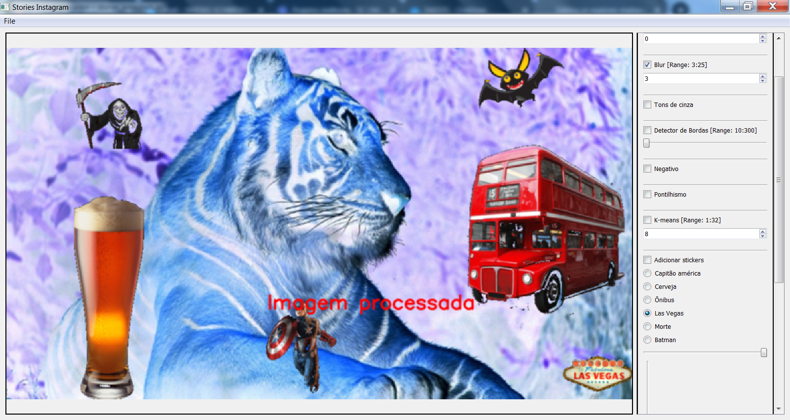

## Exemplo de edição de vídeo

### Negativo do vídeo
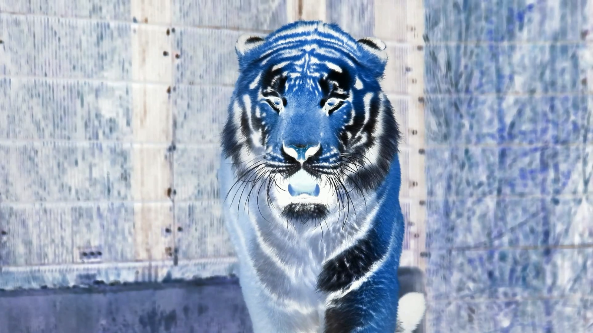

### Sticker no vídeo
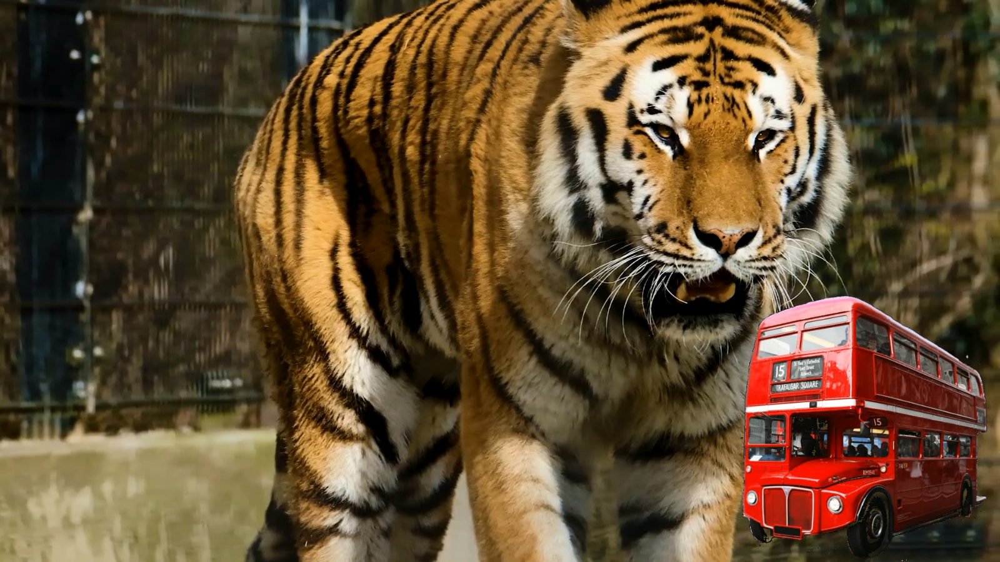

### Sticker no vídeo


## Funcionamento do código

Importação das bibliotecas.
```
import sys, os, cv2, imutils
import numpy as np
from PyQt5.QtWidgets import (QApplication, QMainWindow, QWidget, QLabel, QLineEdit,
                             QPushButton, QCheckBox, QSpinBox, QDoubleSpinBox, QSlider, QFrame, QFileDialog,
                             QMessageBox, QHBoxLayout, QVBoxLayout, QAction)
from PyQt5.QtGui import QPixmap, QImage
from PyQt5 import QtCore, QtWidgets
from PyQt5.QtCore import Qt
```
\
Estilizando a interface com o usuário
```
style_sheet = """
QLabel#ImageLabel{
color: darkgrey;
border: 2px solid #000000;
qproperty-alignment: AlignCenter
}"""
```
\
Classe principal do programa
```
class StoriesInstagram(QMainWindow):
    def __init__(self):
        super().__init__()
        self.initializeUI()
```
\
Função para inicializar as componentes gráficas.
```
    def initializeUI(self):
        self.setMinimumSize(900, 600)
        self.setWindowTitle('Stories Instagram')
        self.contrast_adjusted = False
        self.brightness_adjusted = False
        self.image_smoothing_checked = False
        self.gray_checked = False
        self.edge_detection_checked = False
        self.points_checked = False
        self.kmeans_checked = False
        self.negative_checked = False
        self.stickers_checked = False
        self.text_checked = False
        self.setupWindow()
        self.setupMenu()
        self.show()
```
\
Função para renderizar as componentes gráficas
```
    def setupWindow(self):
        self.image_label = QLabel()
        self.image_label.setObjectName("ImageLabel")

        self.desktop = cv2.imread("assets/stories-do-instagram.png")
        self.convertCVToQImage(self.desktop)

        self.contrast_spinbox = QDoubleSpinBox()
        self.contrast_spinbox.setMinimumWidth(100)
        self.contrast_spinbox.setRange(0.0, 4.0)
        self.contrast_spinbox.setValue(1.0)
        self.contrast_spinbox.setSingleStep(.10)
        self.contrast_cb = QCheckBox("Contraste [Range: 0.0:4.0]")
        self.contrast_cb.stateChanged.connect(self.adjustContrast)

        self.brightness_spinbox = QSpinBox()
        self.brightness_spinbox.setMinimumWidth(100)
        self.brightness_spinbox.setRange(-127, 127)
        self.brightness_spinbox.setValue(0)
        self.brightness_spinbox.setSingleStep(1)
        self.brightness_cb = QCheckBox("Brilho [Range: -127:127]")
        self.brightness_cb.stateChanged.connect(self.adjustBrightness)

        self.smoothing_spinbox = QSpinBox()
        self.smoothing_spinbox.setMinimumWidth(100)
        self.smoothing_spinbox.setRange(3, 25)
        self.smoothing_spinbox.setValue(3)
        self.smoothing_spinbox.setSingleStep(2)
        self.filter_2D_cb = QCheckBox("Blur [Range: 3:25]")
        self.filter_2D_cb.stateChanged.connect(self.imageSmoothingFilter)

        self.gray_cb = QCheckBox("Tons de cinza")
        self.gray_cb.stateChanged.connect(self.makeGray)

        self.edges_slider = QSlider()
        self.edges_slider.setGeometry(QtCore.QRect(370, 340, 160, 19))
        self.edges_slider.setMinimumWidth(100)
        self.edges_slider.setRange(10, 300)
        self.edges_slider.setValue(10)
        self.edges_slider.setSingleStep(10)
        self.edges_slider.setOrientation(QtCore.Qt.Horizontal)
        self.canny_cb = QCheckBox("Detector de Bordas [Range: 10:300]")
        self.canny_cb.stateChanged.connect(self.edgeDetection)

        self.negative_cb = QCheckBox("Negativo")
        self.negative_cb.stateChanged.connect(self.makeNegative)

        self.points_cb = QCheckBox("Pontilhismo")
        self.points_cb.stateChanged.connect(self.makePoints)

        self.kmeans_spinbox = QSpinBox()
        self.kmeans_spinbox.setMinimumWidth(100)
        self.kmeans_spinbox.setRange(1, 32)
        self.kmeans_spinbox.setValue(8)
        self.kmeans_spinbox.setSingleStep(1)
        self.kmeans_cb = QCheckBox("K-means [Range: 1:32]")
        self.kmeans_cb.stateChanged.connect(self.kmeansFilter)

        self.stickers_cb = QCheckBox("Adicionar stickers")
        self.stickers_cb.stateChanged.connect(self.addStickers)

        self.radioButton = QtWidgets.QRadioButton()
        self.radioButton.setGeometry(QtCore.QRect(380, 200, 95, 20))
        self.radioButton.setText("Capitão américa")

        self.radioButton2 = QtWidgets.QRadioButton()
        self.radioButton2.setGeometry(QtCore.QRect(380, 200, 95, 20))
        self.radioButton2.setText("Cerveja")

        self.radioButton3 = QtWidgets.QRadioButton()
        self.radioButton3.setGeometry(QtCore.QRect(380, 200, 95, 20))
        self.radioButton3.setText("Ônibus")

        self.radioButton4 = QtWidgets.QRadioButton()
        self.radioButton4.setGeometry(QtCore.QRect(380, 200, 95, 20))
        self.radioButton4.setText("Las Vegas")

        self.radioButton5 = QtWidgets.QRadioButton()
        self.radioButton5.setGeometry(QtCore.QRect(380, 200, 95, 20))
        self.radioButton5.setText("Morte")

        self.radioButton6 = QtWidgets.QRadioButton()
        self.radioButton6.setGeometry(QtCore.QRect(380, 200, 95, 20))
        self.radioButton6.setText("Batman")

        self.stickers_horizontal_slider = QSlider()
        self.stickers_horizontal_slider.setGeometry(QtCore.QRect(370, 340, 160, 19))
        self.stickers_horizontal_slider.setMinimumWidth(100)
        self.stickers_horizontal_slider.setRange(0, 1200)
        self.stickers_horizontal_slider.setValue(0)
        self.stickers_horizontal_slider.setSingleStep(1)
        self.stickers_horizontal_slider.setOrientation(QtCore.Qt.Horizontal)

        self.stickers_vertical_slider = QSlider()
        self.stickers_vertical_slider.setGeometry(QtCore.QRect(370, 340, 19, 160))
        self.stickers_vertical_slider.setMinimumHeight(200)
        self.stickers_vertical_slider.setInvertedAppearance(True)
        self.stickers_vertical_slider.setRange(0, 920)
        self.stickers_vertical_slider.setValue(0)
        self.stickers_vertical_slider.setSingleStep(1)
        self.stickers_vertical_slider.setOrientation(QtCore.Qt.Vertical)

        self.stickersLabel = QLabel("Tamanho do sticker [Range: 1:5]")
        self.stickers_spinbox = QSpinBox()
        self.stickers_spinbox.setMinimumWidth(100)
        self.stickers_spinbox.setRange(1, 5)
        self.stickers_spinbox.setValue(5)
        self.stickers_spinbox.setSingleStep(1)

        self.text_cb = QCheckBox("Adicionar texto")
        self.text_cb.stateChanged.connect(self.addText)
        self.textQLine = QLineEdit("")
        self.textQLine.setMinimumWidth(100)
        self.textQLine.setMinimumHeight(50)

        self.apply_process_button = QPushButton("Aplicar filtros")
        self.apply_process_button.setEnabled(False)
        self.apply_process_button.clicked.connect(self.applyImageProcessing)

        self.reset_button = QPushButton("Voltar imagem original")
        self.reset_button.setEnabled(False)
        self.reset_button.clicked.connect(self.resetImageAndSettings)

        self.line1 = QtWidgets.QFrame()
        self.line1.setGeometry(QtCore.QRect(200, 420, 118, 3))
        self.line1.setFrameShape(QtWidgets.QFrame.HLine)
        self.line1.setFrameShadow(QtWidgets.QFrame.Sunken)
        self.line1.setObjectName("line1")

        self.line2 = QtWidgets.QFrame()
        self.line2.setGeometry(QtCore.QRect(200, 420, 118, 3))
        self.line2.setFrameShape(QtWidgets.QFrame.HLine)
        self.line2.setFrameShadow(QtWidgets.QFrame.Sunken)
        self.line2.setObjectName("line2")

        self.line3 = QtWidgets.QFrame()
        self.line3.setGeometry(QtCore.QRect(200, 420, 118, 3))
        self.line3.setFrameShape(QtWidgets.QFrame.HLine)
        self.line3.setFrameShadow(QtWidgets.QFrame.Sunken)
        self.line3.setObjectName("line3")

        self.line4 = QtWidgets.QFrame()
        self.line4.setGeometry(QtCore.QRect(200, 420, 118, 3))
        self.line4.setFrameShape(QtWidgets.QFrame.HLine)
        self.line4.setFrameShadow(QtWidgets.QFrame.Sunken)
        self.line4.setObjectName("line4")

        self.line5 = QtWidgets.QFrame()
        self.line5.setGeometry(QtCore.QRect(200, 420, 118, 3))
        self.line5.setFrameShape(QtWidgets.QFrame.HLine)
        self.line5.setFrameShadow(QtWidgets.QFrame.Sunken)
        self.line5.setObjectName("line5")

        self.line6 = QtWidgets.QFrame()
        self.line6.setGeometry(QtCore.QRect(200, 420, 118, 3))
        self.line6.setFrameShape(QtWidgets.QFrame.HLine)
        self.line6.setFrameShadow(QtWidgets.QFrame.Sunken)
        self.line6.setObjectName("line6")

        self.line7 = QtWidgets.QFrame()
        self.line7.setGeometry(QtCore.QRect(200, 420, 118, 3))
        self.line7.setFrameShape(QtWidgets.QFrame.HLine)
        self.line7.setFrameShadow(QtWidgets.QFrame.Sunken)
        self.line7.setObjectName("line7")

        self.line8 = QtWidgets.QFrame()
        self.line8.setGeometry(QtCore.QRect(200, 420, 118, 3))
        self.line8.setFrameShape(QtWidgets.QFrame.HLine)
        self.line8.setFrameShadow(QtWidgets.QFrame.Sunken)
        self.line8.setObjectName("line8")

        self.line9 = QtWidgets.QFrame()
        self.line9.setGeometry(QtCore.QRect(200, 420, 118, 3))
        self.line9.setFrameShape(QtWidgets.QFrame.HLine)
        self.line9.setFrameShadow(QtWidgets.QFrame.Sunken)
        self.line9.setObjectName("line9")

        self.line10 = QtWidgets.QFrame()
        self.line10.setGeometry(QtCore.QRect(200, 420, 118, 3))
        self.line10.setFrameShape(QtWidgets.QFrame.HLine)
        self.line10.setFrameShadow(QtWidgets.QFrame.Sunken)
        self.line10.setObjectName("line10")

        side_panel_v_box = QVBoxLayout()
        side_panel_v_box.setAlignment(Qt.AlignTop)

        side_panel_v_box.addWidget(self.contrast_cb)
        side_panel_v_box.addWidget(self.contrast_spinbox)

        side_panel_v_box.addSpacing(15)
        side_panel_v_box.addWidget(self.line1)

        side_panel_v_box.addWidget(self.brightness_cb)
        side_panel_v_box.addWidget(self.brightness_spinbox)

        side_panel_v_box.addSpacing(15)
        side_panel_v_box.addWidget(self.line2)

        side_panel_v_box.addWidget(self.filter_2D_cb)
        side_panel_v_box.addWidget(self.smoothing_spinbox)

        side_panel_v_box.addSpacing(15)
        side_panel_v_box.addWidget(self.line3)

        side_panel_v_box.addWidget(self.gray_cb)

        side_panel_v_box.addSpacing(15)
        side_panel_v_box.addWidget(self.line4)

        side_panel_v_box.addWidget(self.canny_cb)
        side_panel_v_box.addWidget(self.edges_slider)

        side_panel_v_box.addSpacing(15)
        side_panel_v_box.addWidget(self.line5)

        side_panel_v_box.addWidget(self.negative_cb)

        side_panel_v_box.addSpacing(15)
        side_panel_v_box.addWidget(self.line6)

        side_panel_v_box.addWidget(self.points_cb)

        side_panel_v_box.addSpacing(15)
        side_panel_v_box.addWidget(self.line7)

        side_panel_v_box.addWidget(self.kmeans_cb)
        side_panel_v_box.addWidget(self.kmeans_spinbox)

        side_panel_v_box.addSpacing(15)
        side_panel_v_box.addWidget(self.line8)
        side_panel_v_box.addWidget(self.stickers_cb)

        side_panel_v_box.addWidget(self.radioButton)
        side_panel_v_box.addWidget(self.radioButton2)
        side_panel_v_box.addWidget(self.radioButton3)
        side_panel_v_box.addWidget(self.radioButton4)
        side_panel_v_box.addWidget(self.radioButton5)
        side_panel_v_box.addWidget(self.radioButton6)

        side_panel_v_box.addWidget(self.stickers_horizontal_slider)
        side_panel_v_box.addWidget(self.stickers_vertical_slider)
        side_panel_v_box.addWidget(self.stickersLabel)
        side_panel_v_box.addWidget(self.stickers_spinbox)

        side_panel_v_box.addSpacing(15)
        side_panel_v_box.addWidget(self.line9)
        side_panel_v_box.addWidget(self.text_cb)
        side_panel_v_box.addWidget(self.textQLine)

        side_panel_v_box.addSpacing(100)
        side_panel_v_box.addWidget(self.line10)
        side_panel_v_box.addWidget(self.apply_process_button)
        side_panel_v_box.addWidget(self.reset_button)

        side_panel_frame = QFrame()
        side_panel_frame.setMinimumWidth(250)
        side_panel_frame.setFrameStyle(QFrame.WinPanel)
        side_panel_frame.setLayout(side_panel_v_box)

        scrollArea = QtWidgets.QScrollArea()
        scrollArea.setMinimumWidth(300)
        scrollArea.setWidgetResizable(True)
        scrollArea.setWidget(side_panel_frame)

        main_h_box = QHBoxLayout()
        main_h_box.addWidget(self.image_label, 1)
        main_h_box.addWidget(scrollArea)

        container = QWidget()
        container.setLayout(main_h_box)
        self.setCentralWidget(container)
```
\
Função para renderizar o menu superior.
```
    def setupMenu(self):
        open_image_act = QAction('Abrir imagem', self)
        open_image_act.setShortcut('Ctrl+O')
        open_image_act.triggered.connect(self.openImageFile)
        save_image_act = QAction('Salvar imagem', self)
        save_image_act.setShortcut('Ctrl+S')
        save_image_act.triggered.connect(self.saveImageFile)

        open_video_act = QAction('Abrir video', self)
        open_video_act.setShortcut('Ctrl+O')
        open_video_act.triggered.connect(self.openVideoFile)
        save_video_act = QAction('Salvar video', self)
        save_video_act.setShortcut('Ctrl+S')
        save_video_act.triggered.connect(self.saveVideoFile)

        menu_bar = self.menuBar()
        menu_bar.setNativeMenuBar(False)

        file_menu = menu_bar.addMenu('File')
        file_menu.addAction(open_image_act)
        file_menu.addAction(save_image_act)
        file_menu.addAction(open_video_act)
        file_menu.addAction(save_video_act)
```
\
Funções para identificar o estado de ativação das alterações para cada função FILTRO.
```
    def adjustContrast(self, state):
        if state == Qt.Checked and self.image_label.pixmap() != None:
            self.contrast_adjusted = True
        elif state != Qt.Checked and self.image_label.pixmap() != None:
            self.contrast_adjusted = False


    def adjustBrightness(self, state):
        if state == Qt.Checked and self.image_label.pixmap() != None:
            self.brightness_adjusted = True
        elif state != Qt.Checked and self.image_label.pixmap() != None:
            self.brightness_adjusted = False


    def imageSmoothingFilter(self, state):
        if state == Qt.Checked and self.image_label.pixmap() != None:
            self.image_smoothing_checked = True
        elif state != Qt.Checked and self.image_label.pixmap() != None:
            self.image_smoothing_checked = False


    def makeGray(self, state):
        if state == Qt.Checked and self.image_label.pixmap() != None:
            self.gray_checked = True
        elif state != Qt.Checked and self.image_label.pixmap() != None:
            self.gray_checked = False


    def edgeDetection(self, state):
        if state == Qt.Checked and self.image_label.pixmap() != None:
            self.edge_detection_checked = True
        elif state != Qt.Checked and self.image_label.pixmap() != None:
            self.edge_detection_checked = False


    def makeNegative(self, state):
        if state == Qt.Checked and self.image_label.pixmap() != None:
            self.negative_checked = True
        elif state != Qt.Checked and self.image_label.pixmap() != None:
            self.negative_checked = False


    def makePoints(self, state):
        if state == Qt.Checked and self.image_label.pixmap() != None:
            self.points_checked = True
        elif state != Qt.Checked and self.image_label.pixmap() != None:
            self.points_checked = False


    def kmeansFilter(self, state):
        if state == Qt.Checked and self.image_label.pixmap() != None:
            self.kmeans_checked = True
        elif state != Qt.Checked and self.image_label.pixmap() != None:
            self.kmeans_checked = False

    def addStickers(self, state):
        if state == Qt.Checked and self.image_label.pixmap() != None:
            self.stickers_checked = True
        elif state != Qt.Checked and self.image_label.pixmap() != None:
            self.stickers_checked = False

    def addText(self, state):
        if state == Qt.Checked and self.image_label.pixmap() != None:
            self.text_checked = True
        elif state != Qt.Checked and self.image_label.pixmap() != None:
            self.text_checked = False
```
\
Função para adicionar um sticker à uma imagem, os sliders funcionam em toda a sua região, é possível adicionar um sticker em qualquer área da imagem, e ainda selecionar o tamanho deste sticker.
```
    def overlaySticker(self):
        self.stickers_horizontal_slider.setRange(0, self.cv_image.shape[1])
        self.stickers_vertical_slider.setRange(0, self.cv_image.shape[0])

        self.size = self.stickers_spinbox.value()
        self.axis_x = self.stickers_horizontal_slider.value()
        self.axis_y = self.stickers_vertical_slider.value()

        self.sticker = imutils.resize(self.sticker, width=(self.cv_image.shape[0] // self.size))
        while True:
            if self.sticker.shape[1] <= self.cv_image.shape[1]:
                if self.sticker.shape[0] <= self.cv_image.shape[0]:
                    break
                else:
                    self.sticker = imutils.resize(self.sticker, height=(self.cv_image.shape[0] // 2))
            else:
                self.sticker = imutils.resize(self.sticker, width=(self.cv_image.shape[1] // 2))

        (rows, cols) = self.sticker.shape[:2]
        if (self.axis_y + rows) > self.cv_image.shape[0]:
            self.axis_y = self.cv_image.shape[0] - rows

        if (self.axis_x + cols) > self.cv_image.shape[1]:
            self.axis_x = self.cv_image.shape[1] - cols

        roi = self.cv_image[self.axis_y:(self.axis_y + rows), self.axis_x:(self.axis_x + cols)]
        self.sticker_gray = cv2.cvtColor(self.sticker, cv2.COLOR_BGR2GRAY)
        ret, mask = cv2.threshold(self.sticker_gray, 10, 255, cv2.THRESH_BINARY)
        mask_inv = cv2.bitwise_not(mask)
        self.cv_image_bg = cv2.bitwise_and(roi, roi, mask=mask_inv)
        self.sticker_fg = cv2.bitwise_and(self.sticker, self.sticker, mask=mask)
        dst = cv2.add(self.cv_image_bg, self.sticker_fg)
        self.cv_image[self.axis_y:(self.axis_y + rows), self.axis_x:(self.axis_x + cols)] = dst

```
\
Função para aplicar os filtros escolhidos na imagem.
```
    def applyImageProcessing(self):
        if self.contrast_adjusted == True or self.brightness_adjusted == True:
            contrast = self.contrast_spinbox.value()
            brightness = self.brightness_spinbox.value()
            self.cv_image = cv2.convertScaleAbs(self.cv_image, self.processed_cv_image, contrast, brightness)

        if self.image_smoothing_checked == True:
            blur = self.smoothing_spinbox.value()
            self.cv_image = cv2.GaussianBlur(self.cv_image, (blur, blur), 0)

        if self.gray_checked == True:
            if len(self.cv_image.shape) == 3:
                self.cv_image = cv2.cvtColor(self.cv_image, cv2.COLOR_BGR2GRAY)
            else:
                pass

        if self.edge_detection_checked == True:
            slider = self.edges_slider.value()
            self.cv_image = cv2.Canny(self.cv_image, slider, 3 * slider)

        if self.negative_checked == True:
            self.cv_image = cv2.bitwise_not(self.cv_image)

        if self.points_checked == True:
            STEP = 5
            JITTER = 3
            RAIO = 3
            xrange = np.arange(0, self.cv_image.shape[0] - STEP, STEP) + STEP // 2
            yrange = np.arange(0, self.cv_image.shape[1] - STEP, STEP) + STEP // 2
            points = np.zeros(self.cv_image.shape, dtype=np.uint8)
            np.random.shuffle(xrange)
            for i in xrange:
                np.random.shuffle(yrange)
                for j in yrange:
                    x = i + np.random.randint((2 * JITTER) - JITTER + 1)
                    y = j + np.random.randint((2 * JITTER) - JITTER + 1)
                    color = self.cv_image[x, y]
                    cv2.circle(points, (y, x), RAIO, (int(color[0]), int(color[1]), int(color[2])), -1, cv2.LINE_AA)
            self.cv_image = points.copy()

        if self.kmeans_checked == True:
            NCLUSTERS = self.kmeans_spinbox.value()
            NROUNDS = 10
            samples = self.cv_image.reshape((-1, 3))
            samples = np.float32(samples)
            ret, labels, centers = cv2.kmeans(samples,
                                              NCLUSTERS,
                                              None,
                                              (cv2.TERM_CRITERIA_MAX_ITER | cv2.TERM_CRITERIA_EPS, 10, 1),
                                              NROUNDS,
                                              cv2.KMEANS_RANDOM_CENTERS)
            centers = np.uint8(centers)
            res = centers[labels.flatten()]
            self.cv_image = res.reshape((self.cv_image.shape))


        if self.stickers_checked == True:
            if self.radioButton.isChecked():
                self.sticker = cv2.imread("assets/capitao.png")
                self.overlaySticker()

            elif self.radioButton2.isChecked():
                self.sticker = cv2.imread("assets/cerveja.png")
                self.overlaySticker()

            elif self.radioButton3.isChecked():
                self.sticker = cv2.imread("assets/onibus.png")
                self.overlaySticker()

            elif self.radioButton4.isChecked():
                self.sticker = cv2.imread("assets/lasvegas.png")
                self.overlaySticker()

            elif self.radioButton5.isChecked():
                self.sticker = cv2.imread("assets/morte.png")
                self.overlaySticker()

            elif self.radioButton6.isChecked():
                self.sticker = cv2.imread("assets/batman.png")
                self.overlaySticker()

        if self.text_checked == True:
            text = self.textQLine.text()
            font = cv2.FONT_HERSHEY_SIMPLEX
            org = (400, 400)
            fontScale = 1
            color = (0, 0, 255)
            thickness = 2
            self.cv_image = cv2.putText(self.cv_image, text, org, font, fontScale, color, thickness, cv2.LINE_AA, False)

        self.convertCVToQImage(self.cv_image)
        self.image_label.repaint()
```
\
Função para cancelar os filtros, limpar os checkbox de seleção e voltar a imagem original.
```
    def resetImageAndSettings(self):
        answer = QMessageBox.information(self, "Voltar imagem original",
                                         "Você tem certeza de que deseja voltar a imagem original?",
                                         QMessageBox.Yes | QMessageBox.No, QMessageBox.No)
        if answer == QMessageBox.No:
            pass
        elif answer == QMessageBox.Yes and self.image_label.pixmap() != None:
            self.cv_image = self.copy_cv_image.copy()
            self.resetWidgetValues()
            self.convertCVToQImage(self.copy_cv_image)
            self.image_label.repaint()


    def resetWidgetValues(self):
        self.contrast_cb.setChecked(False)
        self.contrast_spinbox.setValue(1.0)
        self.brightness_cb.setChecked(False)
        self.brightness_spinbox.setValue(0)
        self.filter_2D_cb.setChecked(False)
        self.smoothing_spinbox.setValue(3)
        self.gray_cb.setChecked(False)
        self.canny_cb.setChecked(False)
        self.edges_slider.setValue(10)
        self.negative_cb.setChecked(False)
        self.points_cb.setChecked(False)
        self.kmeans_cb.setChecked(False)
        self.kmeans_spinbox.setValue(8)
        self.stickers_cb.setChecked(False)
        self.stickers_spinbox.setValue(5)
        self.radioButton.setChecked(False)
        self.radioButton2.setChecked(False)
        self.radioButton3.setChecked(False)
        self.radioButton4.setChecked(False)
        self.radioButton5.setChecked(False)
        self.radioButton6.setChecked(False)
        self.stickers_horizontal_slider.setValue(0)
        self.stickers_vertical_slider.setValue(0)
        self.text_cb.setChecked(False)
        self.textQLine.setText("")
```
\
Função para abrir uma imagem.
```
    def openImageFile(self):
        image_file, _ = QFileDialog.getOpenFileName(self, "Abrir imagem",
                                                    os.getenv('HOME'), "Images (*.png *.jpeg *.jpg *.bmp)")
        if image_file:
            self.resetWidgetValues()
            self.apply_process_button.setEnabled(True)
            self.reset_button.setEnabled(True)
            self.cv_image = cv2.imread(image_file)
            self.copy_cv_image = self.cv_image.copy()
            self.processed_cv_image = np.zeros(self.cv_image.shape, self.cv_image.dtype)
            self.convertCVToQImage(self.cv_image)
        else:
            QMessageBox.information(self, "Erro", "Nenhuma imagem foi carregada.", QMessageBox.Ok)
```
\
Função para salvar uma imagem.
```
    def saveImageFile(self):
        image_file, _ = QFileDialog.getSaveFileName(self, "Salvar imagem",
                                                    os.getenv('HOME'),
                                                    "JPEG (*.jpeg);;JPG (*.jpg);;PNG (*.png);;Bitmap (*.bmp)")
        if image_file and self.image_label.pixmap() != None:
            cv2.imwrite(image_file, self.cv_image)
        else:
            QMessageBox.information(self, "Erro",
                                    "Não é possível salvar a imagem.", QMessageBox.Ok)
```
\
Função para abrir um vídeo.
```
    def openVideoFile(self):
        self.input_video_file, _ = QFileDialog.getOpenFileName(self, "Abrir video",
                                                    os.getenv('HOME'), "Video (*.mp4)")
        if self.input_video_file:
            self.resetWidgetValues()
            self.apply_process_button.setEnabled(True)
            self.reset_button.setEnabled(True)
            capture = cv2.VideoCapture(self.input_video_file)
            exist_frame, frame = capture.read()
            self.height, self.width = frame.shape[:2]
            if exist_frame:
                frame = cv2.cvtColor(frame, cv2.IMREAD_COLOR)
                self.cv_image = cv2.cvtColor(frame, cv2.IMREAD_COLOR)
                self.copy_cv_image = self.cv_image.copy()

                self.processed_cv_image = np.zeros(self.cv_image.shape, self.cv_image.dtype)
                self.convertCVToQImage(self.cv_image)
        else:
            QMessageBox.information(self, "Erro", "Nenhum video foi carregado.", QMessageBox.Ok)
```
\
Função para salvar um vídeo.
```
    def saveVideoFile(self):
        self.output_video_file, _ = QFileDialog.getSaveFileName(self, "Salvar video",
                                                    os.getenv('HOME'),
                                                    "AVI (*.avi)")
        if self.output_video_file and self.image_label.pixmap() != None:
            capture = cv2.VideoCapture(self.input_video_file)
            fourcc = cv2.VideoWriter_fourcc(*'XVID')
            out = cv2.VideoWriter(self.output_video_file, fourcc, 24, (self.width, self.height))
            while True:
                exist_frame, frame = capture.read()
                if not exist_frame:
                    break

                self.cv_image = frame
                self.applyImageProcessing()

                frame = self.cv_image
                out.write(frame)

            capture.release()
            out.release()
        else:
            QMessageBox.information(self, "Erro",
                                    "Não é possível salvar o video.", QMessageBox.Ok)
```
\
Função para converter uma imagem carregada pelo OpenCV para uma imagem a ser reconhecida pela função QImage da biblioteca PyQt5.
```
    def convertCVToQImage(self, image):
        cv_image = cv2.cvtColor(image, cv2.COLOR_BGR2RGB)
        height, width, channels = cv_image.shape
        bytes_per_line = width * channels
        converted_Qt_image = QImage(cv_image, width, height, bytes_per_line, QImage.Format_RGB888)
        self.image_label.setPixmap(QPixmap.fromImage(converted_Qt_image).scaled(
            self.image_label.width(), self.image_label.height(),
            Qt.KeepAspectRatio))
```
\
Entrypoint do programa, função principal main para iniciar o programa.
```
if __name__ == '__main__':
    app = QApplication(sys.argv)
    app.setStyleSheet(style_sheet)
    window = StoriesInstagram()
    sys.exit(app.exec_())
```
\


-----------------------------------------------------

## Conclusão
O programa desenvolvido apresentou bons resultados tanto na edição de imagem, quanto na edição de vídeo, o usuário é capaz de carregar um arquivo de imagem ou vídeo, escolher o filtro desejado, aplicar mais de um filtro, e depois salvar, também é possível desfazer os filtros e voltar a imagem original para recomeçar com outros filtros.. A interação do usuário através da interface gráfica utilizando o PyQt5, também se torna mais atrativa durante a edição.


-----------------------------------------------------

## Código final completo em Python
```
import sys, os, cv2, imutils
import numpy as np
from PyQt5.QtWidgets import (QApplication, QMainWindow, QWidget, QLabel, QLineEdit,
                             QPushButton, QCheckBox, QSpinBox, QDoubleSpinBox, QSlider, QFrame, QFileDialog,
                             QMessageBox, QHBoxLayout, QVBoxLayout, QAction)
from PyQt5.QtGui import QPixmap, QImage
from PyQt5 import QtCore, QtWidgets
from PyQt5.QtCore import Qt

style_sheet = """
QLabel#ImageLabel{
color: darkgrey;
border: 2px solid #000000;
qproperty-alignment: AlignCenter
}"""


class StoriesInstagram(QMainWindow):
    def __init__(self):
        super().__init__()
        self.initializeUI()


    def initializeUI(self):
        self.setMinimumSize(900, 600)
        self.setWindowTitle('Stories Instagram')
        self.contrast_adjusted = False
        self.brightness_adjusted = False
        self.image_smoothing_checked = False
        self.gray_checked = False
        self.edge_detection_checked = False
        self.points_checked = False
        self.kmeans_checked = False
        self.negative_checked = False
        self.stickers_checked = False
        self.text_checked = False
        self.setupWindow()
        self.setupMenu()
        self.show()


    def setupWindow(self):
        self.image_label = QLabel()
        self.image_label.setObjectName("ImageLabel")

        self.desktop = cv2.imread("assets/stories-do-instagram.png")
        self.convertCVToQImage(self.desktop)

        self.contrast_spinbox = QDoubleSpinBox()
        self.contrast_spinbox.setMinimumWidth(100)
        self.contrast_spinbox.setRange(0.0, 4.0)
        self.contrast_spinbox.setValue(1.0)
        self.contrast_spinbox.setSingleStep(.10)
        self.contrast_cb = QCheckBox("Contraste [Range: 0.0:4.0]")
        self.contrast_cb.stateChanged.connect(self.adjustContrast)

        self.brightness_spinbox = QSpinBox()
        self.brightness_spinbox.setMinimumWidth(100)
        self.brightness_spinbox.setRange(-127, 127)
        self.brightness_spinbox.setValue(0)
        self.brightness_spinbox.setSingleStep(1)
        self.brightness_cb = QCheckBox("Brilho [Range: -127:127]")
        self.brightness_cb.stateChanged.connect(self.adjustBrightness)

        self.smoothing_spinbox = QSpinBox()
        self.smoothing_spinbox.setMinimumWidth(100)
        self.smoothing_spinbox.setRange(3, 25)
        self.smoothing_spinbox.setValue(3)
        self.smoothing_spinbox.setSingleStep(2)
        self.filter_2D_cb = QCheckBox("Blur [Range: 3:25]")
        self.filter_2D_cb.stateChanged.connect(self.imageSmoothingFilter)

        self.gray_cb = QCheckBox("Tons de cinza")
        self.gray_cb.stateChanged.connect(self.makeGray)

        self.edges_slider = QSlider()
        self.edges_slider.setGeometry(QtCore.QRect(370, 340, 160, 19))
        self.edges_slider.setMinimumWidth(100)
        self.edges_slider.setRange(10, 300)
        self.edges_slider.setValue(10)
        self.edges_slider.setSingleStep(10)
        self.edges_slider.setOrientation(QtCore.Qt.Horizontal)
        self.canny_cb = QCheckBox("Detector de Bordas [Range: 10:300]")
        self.canny_cb.stateChanged.connect(self.edgeDetection)

        self.negative_cb = QCheckBox("Negativo")
        self.negative_cb.stateChanged.connect(self.makeNegative)

        self.points_cb = QCheckBox("Pontilhismo")
        self.points_cb.stateChanged.connect(self.makePoints)

        self.kmeans_spinbox = QSpinBox()
        self.kmeans_spinbox.setMinimumWidth(100)
        self.kmeans_spinbox.setRange(1, 32)
        self.kmeans_spinbox.setValue(8)
        self.kmeans_spinbox.setSingleStep(1)
        self.kmeans_cb = QCheckBox("K-means [Range: 1:32]")
        self.kmeans_cb.stateChanged.connect(self.kmeansFilter)

        self.stickers_cb = QCheckBox("Adicionar stickers")
        self.stickers_cb.stateChanged.connect(self.addStickers)

        self.radioButton = QtWidgets.QRadioButton()
        self.radioButton.setGeometry(QtCore.QRect(380, 200, 95, 20))
        self.radioButton.setText("Capitão américa")

        self.radioButton2 = QtWidgets.QRadioButton()
        self.radioButton2.setGeometry(QtCore.QRect(380, 200, 95, 20))
        self.radioButton2.setText("Cerveja")

        self.radioButton3 = QtWidgets.QRadioButton()
        self.radioButton3.setGeometry(QtCore.QRect(380, 200, 95, 20))
        self.radioButton3.setText("Ônibus")

        self.radioButton4 = QtWidgets.QRadioButton()
        self.radioButton4.setGeometry(QtCore.QRect(380, 200, 95, 20))
        self.radioButton4.setText("Las Vegas")

        self.radioButton5 = QtWidgets.QRadioButton()
        self.radioButton5.setGeometry(QtCore.QRect(380, 200, 95, 20))
        self.radioButton5.setText("Morte")

        self.radioButton6 = QtWidgets.QRadioButton()
        self.radioButton6.setGeometry(QtCore.QRect(380, 200, 95, 20))
        self.radioButton6.setText("Batman")

        self.stickers_horizontal_slider = QSlider()
        self.stickers_horizontal_slider.setGeometry(QtCore.QRect(370, 340, 160, 19))
        self.stickers_horizontal_slider.setMinimumWidth(100)
        self.stickers_horizontal_slider.setRange(0, 1200)
        self.stickers_horizontal_slider.setValue(0)
        self.stickers_horizontal_slider.setSingleStep(1)
        self.stickers_horizontal_slider.setOrientation(QtCore.Qt.Horizontal)

        self.stickers_vertical_slider = QSlider()
        self.stickers_vertical_slider.setGeometry(QtCore.QRect(370, 340, 19, 160))
        self.stickers_vertical_slider.setMinimumHeight(200)
        self.stickers_vertical_slider.setInvertedAppearance(True)
        self.stickers_vertical_slider.setRange(0, 920)
        self.stickers_vertical_slider.setValue(0)
        self.stickers_vertical_slider.setSingleStep(1)
        self.stickers_vertical_slider.setOrientation(QtCore.Qt.Vertical)

        self.stickersLabel = QLabel("Tamanho do sticker [Range: 1:5]")
        self.stickers_spinbox = QSpinBox()
        self.stickers_spinbox.setMinimumWidth(100)
        self.stickers_spinbox.setRange(1, 5)
        self.stickers_spinbox.setValue(5)
        self.stickers_spinbox.setSingleStep(1)

        self.text_cb = QCheckBox("Adicionar texto")
        self.text_cb.stateChanged.connect(self.addText)
        self.textQLine = QLineEdit("")
        self.textQLine.setMinimumWidth(100)
        self.textQLine.setMinimumHeight(50)

        self.apply_process_button = QPushButton("Aplicar filtros")
        self.apply_process_button.setEnabled(False)
        self.apply_process_button.clicked.connect(self.applyImageProcessing)

        self.reset_button = QPushButton("Voltar imagem original")
        self.reset_button.setEnabled(False)
        self.reset_button.clicked.connect(self.resetImageAndSettings)

        self.line1 = QtWidgets.QFrame()
        self.line1.setGeometry(QtCore.QRect(200, 420, 118, 3))
        self.line1.setFrameShape(QtWidgets.QFrame.HLine)
        self.line1.setFrameShadow(QtWidgets.QFrame.Sunken)
        self.line1.setObjectName("line1")

        self.line2 = QtWidgets.QFrame()
        self.line2.setGeometry(QtCore.QRect(200, 420, 118, 3))
        self.line2.setFrameShape(QtWidgets.QFrame.HLine)
        self.line2.setFrameShadow(QtWidgets.QFrame.Sunken)
        self.line2.setObjectName("line2")

        self.line3 = QtWidgets.QFrame()
        self.line3.setGeometry(QtCore.QRect(200, 420, 118, 3))
        self.line3.setFrameShape(QtWidgets.QFrame.HLine)
        self.line3.setFrameShadow(QtWidgets.QFrame.Sunken)
        self.line3.setObjectName("line3")

        self.line4 = QtWidgets.QFrame()
        self.line4.setGeometry(QtCore.QRect(200, 420, 118, 3))
        self.line4.setFrameShape(QtWidgets.QFrame.HLine)
        self.line4.setFrameShadow(QtWidgets.QFrame.Sunken)
        self.line4.setObjectName("line4")

        self.line5 = QtWidgets.QFrame()
        self.line5.setGeometry(QtCore.QRect(200, 420, 118, 3))
        self.line5.setFrameShape(QtWidgets.QFrame.HLine)
        self.line5.setFrameShadow(QtWidgets.QFrame.Sunken)
        self.line5.setObjectName("line5")

        self.line6 = QtWidgets.QFrame()
        self.line6.setGeometry(QtCore.QRect(200, 420, 118, 3))
        self.line6.setFrameShape(QtWidgets.QFrame.HLine)
        self.line6.setFrameShadow(QtWidgets.QFrame.Sunken)
        self.line6.setObjectName("line6")

        self.line7 = QtWidgets.QFrame()
        self.line7.setGeometry(QtCore.QRect(200, 420, 118, 3))
        self.line7.setFrameShape(QtWidgets.QFrame.HLine)
        self.line7.setFrameShadow(QtWidgets.QFrame.Sunken)
        self.line7.setObjectName("line7")

        self.line8 = QtWidgets.QFrame()
        self.line8.setGeometry(QtCore.QRect(200, 420, 118, 3))
        self.line8.setFrameShape(QtWidgets.QFrame.HLine)
        self.line8.setFrameShadow(QtWidgets.QFrame.Sunken)
        self.line8.setObjectName("line8")

        self.line9 = QtWidgets.QFrame()
        self.line9.setGeometry(QtCore.QRect(200, 420, 118, 3))
        self.line9.setFrameShape(QtWidgets.QFrame.HLine)
        self.line9.setFrameShadow(QtWidgets.QFrame.Sunken)
        self.line9.setObjectName("line9")

        self.line10 = QtWidgets.QFrame()
        self.line10.setGeometry(QtCore.QRect(200, 420, 118, 3))
        self.line10.setFrameShape(QtWidgets.QFrame.HLine)
        self.line10.setFrameShadow(QtWidgets.QFrame.Sunken)
        self.line10.setObjectName("line10")

        side_panel_v_box = QVBoxLayout()
        side_panel_v_box.setAlignment(Qt.AlignTop)

        side_panel_v_box.addWidget(self.contrast_cb)
        side_panel_v_box.addWidget(self.contrast_spinbox)

        side_panel_v_box.addSpacing(15)
        side_panel_v_box.addWidget(self.line1)

        side_panel_v_box.addWidget(self.brightness_cb)
        side_panel_v_box.addWidget(self.brightness_spinbox)

        side_panel_v_box.addSpacing(15)
        side_panel_v_box.addWidget(self.line2)

        side_panel_v_box.addWidget(self.filter_2D_cb)
        side_panel_v_box.addWidget(self.smoothing_spinbox)

        side_panel_v_box.addSpacing(15)
        side_panel_v_box.addWidget(self.line3)

        side_panel_v_box.addWidget(self.gray_cb)

        side_panel_v_box.addSpacing(15)
        side_panel_v_box.addWidget(self.line4)

        side_panel_v_box.addWidget(self.canny_cb)
        side_panel_v_box.addWidget(self.edges_slider)

        side_panel_v_box.addSpacing(15)
        side_panel_v_box.addWidget(self.line5)

        side_panel_v_box.addWidget(self.negative_cb)

        side_panel_v_box.addSpacing(15)
        side_panel_v_box.addWidget(self.line6)

        side_panel_v_box.addWidget(self.points_cb)

        side_panel_v_box.addSpacing(15)
        side_panel_v_box.addWidget(self.line7)

        side_panel_v_box.addWidget(self.kmeans_cb)
        side_panel_v_box.addWidget(self.kmeans_spinbox)

        side_panel_v_box.addSpacing(15)
        side_panel_v_box.addWidget(self.line8)
        side_panel_v_box.addWidget(self.stickers_cb)

        side_panel_v_box.addWidget(self.radioButton)
        side_panel_v_box.addWidget(self.radioButton2)
        side_panel_v_box.addWidget(self.radioButton3)
        side_panel_v_box.addWidget(self.radioButton4)
        side_panel_v_box.addWidget(self.radioButton5)
        side_panel_v_box.addWidget(self.radioButton6)

        side_panel_v_box.addWidget(self.stickers_horizontal_slider)
        side_panel_v_box.addWidget(self.stickers_vertical_slider)
        side_panel_v_box.addWidget(self.stickersLabel)
        side_panel_v_box.addWidget(self.stickers_spinbox)

        side_panel_v_box.addSpacing(15)
        side_panel_v_box.addWidget(self.line9)
        side_panel_v_box.addWidget(self.text_cb)
        side_panel_v_box.addWidget(self.textQLine)

        side_panel_v_box.addSpacing(100)
        side_panel_v_box.addWidget(self.line10)
        side_panel_v_box.addWidget(self.apply_process_button)
        side_panel_v_box.addWidget(self.reset_button)

        side_panel_frame = QFrame()
        side_panel_frame.setMinimumWidth(250)
        side_panel_frame.setFrameStyle(QFrame.WinPanel)
        side_panel_frame.setLayout(side_panel_v_box)

        scrollArea = QtWidgets.QScrollArea()
        scrollArea.setMinimumWidth(300)
        scrollArea.setWidgetResizable(True)
        scrollArea.setWidget(side_panel_frame)

        main_h_box = QHBoxLayout()
        main_h_box.addWidget(self.image_label, 1)
        main_h_box.addWidget(scrollArea)

        container = QWidget()
        container.setLayout(main_h_box)
        self.setCentralWidget(container)


    def setupMenu(self):
        open_image_act = QAction('Abrir imagem', self)
        open_image_act.setShortcut('Ctrl+O')
        open_image_act.triggered.connect(self.openImageFile)
        save_image_act = QAction('Salvar imagem', self)
        save_image_act.setShortcut('Ctrl+S')
        save_image_act.triggered.connect(self.saveImageFile)

        open_video_act = QAction('Abrir video', self)
        open_video_act.setShortcut('Ctrl+O')
        open_video_act.triggered.connect(self.openVideoFile)
        save_video_act = QAction('Salvar video', self)
        save_video_act.setShortcut('Ctrl+S')
        save_video_act.triggered.connect(self.saveVideoFile)

        menu_bar = self.menuBar()
        menu_bar.setNativeMenuBar(False)

        file_menu = menu_bar.addMenu('File')
        file_menu.addAction(open_image_act)
        file_menu.addAction(save_image_act)
        file_menu.addAction(open_video_act)
        file_menu.addAction(save_video_act)


    def adjustContrast(self, state):
        if state == Qt.Checked and self.image_label.pixmap() != None:
            self.contrast_adjusted = True
        elif state != Qt.Checked and self.image_label.pixmap() != None:
            self.contrast_adjusted = False


    def adjustBrightness(self, state):
        if state == Qt.Checked and self.image_label.pixmap() != None:
            self.brightness_adjusted = True
        elif state != Qt.Checked and self.image_label.pixmap() != None:
            self.brightness_adjusted = False


    def imageSmoothingFilter(self, state):
        if state == Qt.Checked and self.image_label.pixmap() != None:
            self.image_smoothing_checked = True
        elif state != Qt.Checked and self.image_label.pixmap() != None:
            self.image_smoothing_checked = False


    def makeGray(self, state):
        if state == Qt.Checked and self.image_label.pixmap() != None:
            self.gray_checked = True
        elif state != Qt.Checked and self.image_label.pixmap() != None:
            self.gray_checked = False


    def edgeDetection(self, state):
        if state == Qt.Checked and self.image_label.pixmap() != None:
            self.edge_detection_checked = True
        elif state != Qt.Checked and self.image_label.pixmap() != None:
            self.edge_detection_checked = False


    def makeNegative(self, state):
        if state == Qt.Checked and self.image_label.pixmap() != None:
            self.negative_checked = True
        elif state != Qt.Checked and self.image_label.pixmap() != None:
            self.negative_checked = False


    def makePoints(self, state):
        if state == Qt.Checked and self.image_label.pixmap() != None:
            self.points_checked = True
        elif state != Qt.Checked and self.image_label.pixmap() != None:
            self.points_checked = False


    def kmeansFilter(self, state):
        if state == Qt.Checked and self.image_label.pixmap() != None:
            self.kmeans_checked = True
        elif state != Qt.Checked and self.image_label.pixmap() != None:
            self.kmeans_checked = False

    def addStickers(self, state):
        if state == Qt.Checked and self.image_label.pixmap() != None:
            self.stickers_checked = True
        elif state != Qt.Checked and self.image_label.pixmap() != None:
            self.stickers_checked = False

    def addText(self, state):
        if state == Qt.Checked and self.image_label.pixmap() != None:
            self.text_checked = True
        elif state != Qt.Checked and self.image_label.pixmap() != None:
            self.text_checked = False

    def overlaySticker(self):
        self.stickers_horizontal_slider.setRange(0, self.cv_image.shape[1])
        self.stickers_vertical_slider.setRange(0, self.cv_image.shape[0])

        self.size = self.stickers_spinbox.value()
        self.axis_x = self.stickers_horizontal_slider.value()
        self.axis_y = self.stickers_vertical_slider.value()

        self.sticker = imutils.resize(self.sticker, width=(self.cv_image.shape[0] // self.size))
        while True:
            if self.sticker.shape[1] <= self.cv_image.shape[1]:
                if self.sticker.shape[0] <= self.cv_image.shape[0]:
                    break
                else:
                    self.sticker = imutils.resize(self.sticker, height=(self.cv_image.shape[0] // 2))
            else:
                self.sticker = imutils.resize(self.sticker, width=(self.cv_image.shape[1] // 2))

        (rows, cols) = self.sticker.shape[:2]
        if (self.axis_y + rows) > self.cv_image.shape[0]:
            self.axis_y = self.cv_image.shape[0] - rows

        if (self.axis_x + cols) > self.cv_image.shape[1]:
            self.axis_x = self.cv_image.shape[1] - cols

        roi = self.cv_image[self.axis_y:(self.axis_y + rows), self.axis_x:(self.axis_x + cols)]
        self.sticker_gray = cv2.cvtColor(self.sticker, cv2.COLOR_BGR2GRAY)
        ret, mask = cv2.threshold(self.sticker_gray, 10, 255, cv2.THRESH_BINARY)
        mask_inv = cv2.bitwise_not(mask)
        self.cv_image_bg = cv2.bitwise_and(roi, roi, mask=mask_inv)
        self.sticker_fg = cv2.bitwise_and(self.sticker, self.sticker, mask=mask)
        dst = cv2.add(self.cv_image_bg, self.sticker_fg)
        self.cv_image[self.axis_y:(self.axis_y + rows), self.axis_x:(self.axis_x + cols)] = dst


    def applyImageProcessing(self):
        if self.contrast_adjusted == True or self.brightness_adjusted == True:
            contrast = self.contrast_spinbox.value()
            brightness = self.brightness_spinbox.value()
            self.cv_image = cv2.convertScaleAbs(self.cv_image, self.processed_cv_image, contrast, brightness)

        if self.image_smoothing_checked == True:
            blur = self.smoothing_spinbox.value()
            self.cv_image = cv2.GaussianBlur(self.cv_image, (blur, blur), 0)

        if self.gray_checked == True:
            if len(self.cv_image.shape) == 3:
                self.cv_image = cv2.cvtColor(self.cv_image, cv2.COLOR_BGR2GRAY)
            else:
                pass

        if self.edge_detection_checked == True:
            slider = self.edges_slider.value()
            self.cv_image = cv2.Canny(self.cv_image, slider, 3 * slider)

        if self.negative_checked == True:
            self.cv_image = cv2.bitwise_not(self.cv_image)

        if self.points_checked == True:
            STEP = 5
            JITTER = 3
            RAIO = 3
            xrange = np.arange(0, self.cv_image.shape[0] - STEP, STEP) + STEP // 2
            yrange = np.arange(0, self.cv_image.shape[1] - STEP, STEP) + STEP // 2
            points = np.zeros(self.cv_image.shape, dtype=np.uint8)
            np.random.shuffle(xrange)
            for i in xrange:
                np.random.shuffle(yrange)
                for j in yrange:
                    x = i + np.random.randint((2 * JITTER) - JITTER + 1)
                    y = j + np.random.randint((2 * JITTER) - JITTER + 1)
                    color = self.cv_image[x, y]
                    cv2.circle(points, (y, x), RAIO, (int(color[0]), int(color[1]), int(color[2])), -1, cv2.LINE_AA)
            self.cv_image = points.copy()

        if self.kmeans_checked == True:
            NCLUSTERS = self.kmeans_spinbox.value()
            NROUNDS = 10
            samples = self.cv_image.reshape((-1, 3))
            samples = np.float32(samples)
            ret, labels, centers = cv2.kmeans(samples,
                                              NCLUSTERS,
                                              None,
                                              (cv2.TERM_CRITERIA_MAX_ITER | cv2.TERM_CRITERIA_EPS, 10, 1),
                                              NROUNDS,
                                              cv2.KMEANS_RANDOM_CENTERS)
            centers = np.uint8(centers)
            res = centers[labels.flatten()]
            self.cv_image = res.reshape((self.cv_image.shape))


        if self.stickers_checked == True:
            if self.radioButton.isChecked():
                self.sticker = cv2.imread("assets/capitao.png")
                self.overlaySticker()

            elif self.radioButton2.isChecked():
                self.sticker = cv2.imread("assets/cerveja.png")
                self.overlaySticker()

            elif self.radioButton3.isChecked():
                self.sticker = cv2.imread("assets/onibus.png")
                self.overlaySticker()

            elif self.radioButton4.isChecked():
                self.sticker = cv2.imread("assets/lasvegas.png")
                self.overlaySticker()

            elif self.radioButton5.isChecked():
                self.sticker = cv2.imread("assets/morte.png")
                self.overlaySticker()

            elif self.radioButton6.isChecked():
                self.sticker = cv2.imread("assets/batman.png")
                self.overlaySticker()

        if self.text_checked == True:
            text = self.textQLine.text()
            font = cv2.FONT_HERSHEY_SIMPLEX
            org = (400, 400)
            fontScale = 1
            color = (0, 0, 255)
            thickness = 2
            self.cv_image = cv2.putText(self.cv_image, text, org, font, fontScale, color, thickness, cv2.LINE_AA, False)

        self.convertCVToQImage(self.cv_image)
        self.image_label.repaint()


    def resetImageAndSettings(self):
        answer = QMessageBox.information(self, "Voltar imagem original",
                                         "Você tem certeza de que deseja voltar a imagem original?",
                                         QMessageBox.Yes | QMessageBox.No, QMessageBox.No)
        if answer == QMessageBox.No:
            pass
        elif answer == QMessageBox.Yes and self.image_label.pixmap() != None:
            self.cv_image = self.copy_cv_image.copy()
            self.resetWidgetValues()
            self.convertCVToQImage(self.copy_cv_image)
            self.image_label.repaint()


    def resetWidgetValues(self):
        self.contrast_cb.setChecked(False)
        self.contrast_spinbox.setValue(1.0)
        self.brightness_cb.setChecked(False)
        self.brightness_spinbox.setValue(0)
        self.filter_2D_cb.setChecked(False)
        self.smoothing_spinbox.setValue(3)
        self.gray_cb.setChecked(False)
        self.canny_cb.setChecked(False)
        self.edges_slider.setValue(10)
        self.negative_cb.setChecked(False)
        self.points_cb.setChecked(False)
        self.kmeans_cb.setChecked(False)
        self.kmeans_spinbox.setValue(8)
        self.stickers_cb.setChecked(False)
        self.stickers_spinbox.setValue(5)
        self.radioButton.setChecked(False)
        self.radioButton2.setChecked(False)
        self.radioButton3.setChecked(False)
        self.radioButton4.setChecked(False)
        self.radioButton5.setChecked(False)
        self.radioButton6.setChecked(False)
        self.stickers_horizontal_slider.setValue(0)
        self.stickers_vertical_slider.setValue(0)
        self.text_cb.setChecked(False)
        self.textQLine.setText("")

    def openImageFile(self):
        image_file, _ = QFileDialog.getOpenFileName(self, "Abrir imagem",
                                                    os.getenv('HOME'), "Images (*.png *.jpeg *.jpg *.bmp)")
        if image_file:
            self.resetWidgetValues()
            self.apply_process_button.setEnabled(True)
            self.reset_button.setEnabled(True)
            self.cv_image = cv2.imread(image_file)
            self.copy_cv_image = self.cv_image.copy()
            self.processed_cv_image = np.zeros(self.cv_image.shape, self.cv_image.dtype)
            self.convertCVToQImage(self.cv_image)
        else:
            QMessageBox.information(self, "Erro", "Nenhuma imagem foi carregada.", QMessageBox.Ok)


    def saveImageFile(self):
        image_file, _ = QFileDialog.getSaveFileName(self, "Salvar imagem",
                                                    os.getenv('HOME'),
                                                    "JPEG (*.jpeg);;JPG (*.jpg);;PNG (*.png);;Bitmap (*.bmp)")
        if image_file and self.image_label.pixmap() != None:
            cv2.imwrite(image_file, self.cv_image)
        else:
            QMessageBox.information(self, "Erro",
                                    "Não é possível salvar a imagem.", QMessageBox.Ok)


    def openVideoFile(self):
        self.input_video_file, _ = QFileDialog.getOpenFileName(self, "Abrir video",
                                                    os.getenv('HOME'), "Video (*.mp4)")
        if self.input_video_file:
            self.resetWidgetValues()
            self.apply_process_button.setEnabled(True)
            self.reset_button.setEnabled(True)
            capture = cv2.VideoCapture(self.input_video_file)
            exist_frame, frame = capture.read()
            self.height, self.width = frame.shape[:2]
            if exist_frame:
                frame = cv2.cvtColor(frame, cv2.IMREAD_COLOR)
                self.cv_image = cv2.cvtColor(frame, cv2.IMREAD_COLOR)
                self.copy_cv_image = self.cv_image.copy()

                self.processed_cv_image = np.zeros(self.cv_image.shape, self.cv_image.dtype)
                self.convertCVToQImage(self.cv_image)
        else:
            QMessageBox.information(self, "Erro", "Nenhum video foi carregado.", QMessageBox.Ok)


    def saveVideoFile(self):
        self.output_video_file, _ = QFileDialog.getSaveFileName(self, "Salvar video",
                                                    os.getenv('HOME'),
                                                    "AVI (*.avi)")
        if self.output_video_file and self.image_label.pixmap() != None:
            capture = cv2.VideoCapture(self.input_video_file)
            fourcc = cv2.VideoWriter_fourcc(*'XVID')
            out = cv2.VideoWriter(self.output_video_file, fourcc, 24, (self.width, self.height))
            while True:
                exist_frame, frame = capture.read()
                if not exist_frame:
                    break

                self.cv_image = frame
                self.applyImageProcessing()

                frame = self.cv_image
                out.write(frame)

            capture.release()
            out.release()
        else:
            QMessageBox.information(self, "Erro",
                                    "Não é possível salvar o video.", QMessageBox.Ok)


    def convertCVToQImage(self, image):
        cv_image = cv2.cvtColor(image, cv2.COLOR_BGR2RGB)
        height, width, channels = cv_image.shape
        bytes_per_line = width * channels
        converted_Qt_image = QImage(cv_image, width, height, bytes_per_line, QImage.Format_RGB888)
        self.image_label.setPixmap(QPixmap.fromImage(converted_Qt_image).scaled(
            self.image_label.width(), self.image_label.height(),
            Qt.KeepAspectRatio))


if __name__ == '__main__':
    app = QApplication(sys.argv)
    app.setStyleSheet(style_sheet)
    window = StoriesInstagram()
    sys.exit(app.exec_())
```


